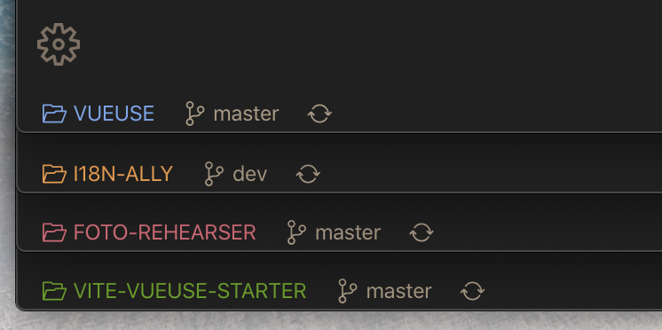

# Where Am I? - VS Code extension

Don't get lost even you have multiple VS Code opened.

Modified base on [maliarov/vscode-project-name-in-statusbar](https://github.com/maliarov/vscode-project-name-in-statusbar).

## Configurations

<!-- configs -->

| Key                         | Description                                                                                                              | Type      | Default                                |
| --------------------------- | ------------------------------------------------------------------------------------------------------------------------ | --------- | -------------------------------------- |
| `where-am-i.colorful`       | Use color                                                                                                                | `boolean` | `true`                                 |
| `where-am-i.color`          | The color of status text. When not defined, a random color will be used based on the project name.                       | `string`  | `""`                                   |
| `where-am-i.align`          | Defines The alignment of the label, requires restart of vscode                                                           | `string`  | `"left"`                               |
| `where-am-i.alignPriority`  | Defines priority of the label. Higher values mean the label should be shown more to the left, requires restart of vscode | `number`  | `100000`                               |
| `where-am-i.textTransfrom`  | Defines project name text style inside template                                                                          | `string`  | `"capitalize"`                         |
| `where-am-i.command`        | The command to execute when clicking the status bar item.                                                                | `string`  | `"workbench.action.quickSwitchWindow"` |
| `where-am-i.icon`           | Codicon id                                                                                                               | `string`  | `"folder-opened"`                      |
| `where-am-i.template`       | Defines template of project name placeholder                                                                             | `string`  | `"{icon} {project-name}"`              |
| `where-am-i.projectSetting` | Project preference                                                                                                       | `object`  | `{}`                                   |

<!-- configs -->

## Commands

<!-- commands -->

| Command             | Title                                 |
| ------------------- | ------------------------------------- |
| `where-am-i.config` | Where Am I: Config the name and color |

<!-- commands -->
